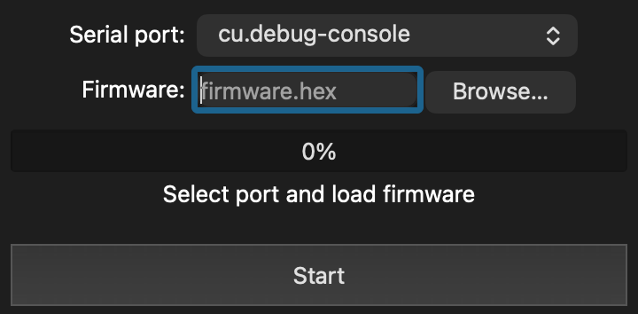

# QTinkup

A Qt 6 desktop application for updating [RetroTINK](https://www.retrotink.com) firmware.

QTinkup is a GUI fork of [`tinkup.py`](https://github.com/rmull/tinkup) by Ryan Mullen. It speaks the same
bootloader protocol, byte for byte, but replaces the command-line workflow with a small
native window: pick a serial port, pick a firmware file, press Start.



## Features

- **Port dropdown** populated with every serial port detected at startup. FTDI devices —
  what RetroTINK hardware enumerates as — are preselected automatically.
- **Progress bar** that advances in 5% checkpoints as firmware records are transmitted.
- **Status label** reporting the current phase: `Ready!`, `Writing...`, `Success!`, or
  `Error occurred. Check logs.`
- **Firmware validation** before the port is ever opened — every HEX record checksum is
  verified, so a corrupt file fails immediately instead of halfway through a flash.
- **Watchdog timeouts** (5 s for probe/write acknowledgements, 60 s for the flash erase),
  so a device that stops responding can't hang the application.
- **Deterministic cleanup** — open file buffers and the serial port are closed on the Exit
  menu action, on window close, and on any error path.

## Requirements

- Qt 6.9 or newer, with the **Widgets** and **SerialPort** modules (I used 6.9.3 at the time of writing)
- CMake 3.21 or newer
- A C++17 compiler (Clang, GCC, or MSVC)

## Building

```sh
cmake -B build -DCMAKE_PREFIX_PATH=/path/to/Qt/x.y.z/<platform>
cmake --build build
```

Point `CMAKE_PREFIX_PATH` at the Qt kit directory for your platform — for example
`~/Qt/6.9.3/macos`, `~/Qt/6.9.3/gcc_64`, or `C:/Qt/6.9.3/msvc2022_64`. If Qt 6 came from
your distribution's package manager (`qt6-base-dev` and `qt6-serialport-dev` on Debian and
Ubuntu), you can omit the flag entirely.

The build produces `qtinkup.app` on macOS and `qtinkup` (or `qtinkup.exe`) elsewhere.

### Platform notes

- **Windows** — the executable is built for the GUI subsystem, so it has no attached
  console and log output is not visible when launched by double-click. Run it from a
  terminal to see the logs, or set `WIN32_EXECUTABLE OFF` in `CMakeLists.txt` if you would
  rather always have a console window. Use `windeployqt` to gather the Qt DLLs for
  distribution.
- **Linux** — serial port access usually requires membership in the `dialout` group (`uucp`
  on Arch): `sudo usermod -aG dialout $USER`, then log out and back in. **THIS IS IMPORTANT**
- **macOS** — no additional setup; the FTDI driver is built into recent macOS versions.

## Usage

1. Put the device into bootloader mode and connect it over USB.
2. Launch QTinkup. The port dropdown fills automatically; an FTDI device is preselected.
3. Click **Browse…** and choose the firmware `.hex` file.
4. Press **Start**.

The status label shows `Writing...` while records stream to the device and `Success!` when
the firmware has been written and the device instructed to boot it. Logs go to standard
error throughout — run from a terminal to follow along.

> **Do not disconnect the device or quit the application during an update.** The flash is
> erased before the first record is written, so an interrupted update leaves the device in
> the bootloader with no valid firmware. Recovery is simply running the update again.

## Project layout

```
src/tink.{h,cpp}         Bootloader protocol engine (framing, CRC, state machines)
src/mainwindow.{h,cpp}   QWidgets user interface
src/main.cpp             Entry point and application version
tests/test_tink.cpp      Unit tests for the protocol engine
tinkup.py                The original script, kept for reference
```

The protocol engine has no dependency on the UI: it is a `QObject` that emits
`progress`, `writingStarted`, and `finished` signals, driven entirely by `QSerialPort`
events on the main thread.

## Tests

```sh
cmake --build build
ctest --test-dir build --output-on-failure
```

The suite covers the parts where a mistake would corrupt a device: CRC values, 
frame construction and control-byte escaping,the receive state machine's deframing 
and unescaping, rejection of corrupt CRCs, HEX file validation, and a simulated 
end-to-end update session that exercises every bootloader state transition without hardware.

## Credits

- Original [`tinkup.py`](https://github.com/rmull/tinkup) by **Ryan Mullen**
  ([@rmull](https://github.com/rmull)) — all protocol design and reverse engineering. 
- Qt 6 fork by **Roberto M.** ([@ateliertsuki](https://github.com/ateliertsuki)).

## License

See LICENSE

## Disclaimer

Not affiliated with or endorsed by RetroTINK. Flashing firmware carries risk; use at your
own risk.
